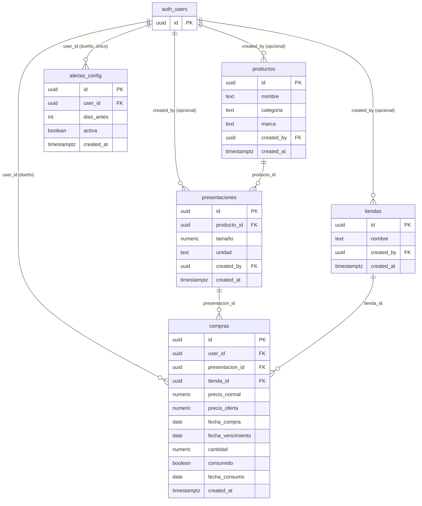

# Schema de base de datos — Alacena

Tracking personal de compras de supermercado. Backend: Supabase (Postgres 17) +
`supabase-js` v2. Este documento describe el schema aplicado en
`supabase/migrations/`.

## Diagrama



Vista ASCII rápida de las relaciones y del alcance de cada tabla (🌐 = catálogo
compartido, 🔒 = privado por usuario):

```
auth.users
   │
   ├── 🌐 tiendas            (compartida; created_by = autor)
   ├── 🌐 productos           (compartida; created_by = autor)
   │        └── 🌐 presentaciones (tamaño+unidad de un producto)
   │                 └── 🔒 compras ── tienda_id ──▶ tiendas
   └── 🔒 alertas_config     (1 fila por usuario)
```

## Decisión de diseño: qué es compartido y qué es privado

- **`tiendas`, `productos`, `presentaciones` → catálogo compartido** entre todos
  los usuarios. Cualquier usuario autenticado puede leer y crear filas nuevas;
  solo quien creó una fila (`created_by`) puede editarla o borrarla.
  **Por qué:** el objetivo #3 del schema es comparar el precio de "el mismo
  producto" entre tiendas. Si cada usuario tuviera su propia copia de "Leche
  Entera 1L", la comparación entre compras de distintos días/tiendas —incluso
  del mismo usuario— se rompería por duplicados, y no tendría sentido de
  catálogo colaborativo. `created_by` es nullable y se limpia (`on delete set
  null`) si el usuario es borrado, así el catálogo compartido no se destruye.
- **`compras`, `alertas_config` → privadas por usuario** (`user_id = auth.uid()`
  en cada policy de RLS). El historial de compras y la configuración de
  alertas son datos personales; nadie debe ver ni editar los de otro usuario.

## Migraciones

En `supabase/migrations/`, en orden de aplicación:

1. `20260823140000_tiendas.sql` — tabla `tiendas`, RLS, índice único por
   nombre normalizado, grants.
2. `20260823140100_productos.sql` — tabla `productos`, RLS, índices, grants.
3. `20260823140200_presentaciones.sql` — tabla `presentaciones` (FK a
   `productos`), índice por `producto_id` (requisito 5), RLS, grants.
4. `20260823140300_compras.sql` — tabla `compras` (incluye `consumido` y
   `fecha_consumo`, requisito 4), índices por `presentacion_id`, `tienda_id`,
   `fecha_vencimiento` y `user_id` (requisito 5), RLS, grants.
5. `20260823140400_alertas_config.sql` — tabla `alertas_config` (una fila por
   usuario), RLS, grants.
6. `20260823140500_vistas_precio_y_stock.sql` — función
   `calcular_precio_unitario` y las vistas `vista_precio_unitario`,
   `vista_stock_actual`, `vista_alertas_vencimiento`.
7. `20260823150000_push_subscriptions.sql` — tabla `push_subscriptions`
   (endpoint + keys de Web Push por usuario/dispositivo), RLS, grants. Ver
   `docs/pwa-push.md`.
8. `20260823150100_compras_alerta_enviada.sql` — agrega
   `compras.alerta_enviada_at` (dedup del cron de push) y actualiza
   `vista_alertas_vencimiento` para exponerla.

### Nota sobre GRANTs (importante en este proyecto)

El `supabase/config.toml` de este proyecto usa el default nuevo de Supabase:
las tablas/vistas creadas en `public` **no** quedan expuestas a los roles de
la Data API (`anon`, `authenticated`) solo por tener RLS — hace falta `GRANT`
explícito además de las policies (`auto_expose_new_tables` ya no aplica). Por
eso cada migración incluye, además de las policies, los `GRANT ... TO
authenticated` correspondientes. El rol `anon` no recibe ningún grant: la app
requiere sesión iniciada para leer o escribir cualquier tabla. Verificado
localmente: `anon` obtiene `permission denied` en las 5 tablas.

## RLS aplicado (resumen)

| Tabla | SELECT | INSERT | UPDATE | DELETE |
|---|---|---|---|---|
| `tiendas` | cualquier `authenticated` | `authenticated`, `created_by = auth.uid()` | solo el creador | solo el creador |
| `productos` | cualquier `authenticated` | `authenticated`, `created_by = auth.uid()` | solo el creador | solo el creador |
| `presentaciones` | cualquier `authenticated` | `authenticated`, `created_by = auth.uid()` | solo el creador | solo el creador |
| `compras` | solo dueño (`user_id = auth.uid()`) | dueño | dueño | dueño |
| `alertas_config` | solo dueño | dueño | dueño | dueño |
| `push_subscriptions` | solo dueño | dueño | dueño | dueño |

`user_id` y `created_by` tienen `default auth.uid()`, así el cliente
(`supabase-js`) no necesita enviarlos explícitamente al hacer `insert()`; el
`WITH CHECK` de cada policy igual garantiza que no se pueda falsificar el
dueño aunque el cliente los envíe.

## Funciones y vistas

### `calcular_precio_unitario(precio numeric, tamano numeric) → numeric`

Función SQL pura (`immutable`) que calcula `precio / tamaño`, redondeado a 4
decimales, devolviendo `null` si `tamaño` es `null` o `0` (evita división por
cero). Es el bloque de cálculo que reutiliza `vista_precio_unitario`.

### `vista_precio_unitario` — requisito 3

Una fila por compra (del usuario autenticado, por RLS de `compras`) con
producto, presentación y tienda ya resueltos, más `precio_pagado`
(`precio_oferta` si existe, si no `precio_normal`) y `precio_por_unidad`
(`precio_pagado / tamaño`). Permite comparar el mismo producto entre tiendas,
por ejemplo:

```sql
select tienda_nombre, precio_por_unidad
from vista_precio_unitario
where producto_id = '...'
order by precio_por_unidad asc;
```

### `vista_stock_actual` — requisito 4

Agrega, por usuario y por producto/presentación, las compras con
`consumido = false` (`cantidad_total_pendiente`, `compras_pendientes`,
`proxima_fecha_vencimiento`). "Resta" las consumidas excluyéndolas del
`where`, en vez de hacer una resta aritmética — así cada compra individual
sigue siendo un registro histórico íntegro y auditable.

### `vista_alertas_vencimiento` (extra)

No pedida explícitamente por el enunciado, pero se desprende del requisito 5
("índices ... para queries de alertas"): cruza `compras` no consumidas con
`alertas_config` y devuelve las que ya entraron en la ventana de aviso
(`fecha_vencimiento <= current_date + dias_antes`).

Las tres vistas se crean con `security_invoker = true`: sin esa opción, una
vista podría evaluar RLS con los privilegios del dueño de la vista en vez de
los del usuario que consulta. Con `security_invoker`, quedan tan protegidas
como las tablas que consultan (verificado localmente: un segundo usuario
obtiene 0 filas en `vista_precio_unitario` aunque el primero tenga compras
cargadas).

## Índices (requisito 5)

- `compras_fecha_vencimiento_idx` — parcial, `where fecha_vencimiento is not
  null and consumido = false` (la única franja que consultan las alertas).
- `presentaciones_producto_id_idx`, `compras_producto_via_presentacion_idx`
  (`presentacion_id`), `compras_tienda_id_idx` — joins de comparación de
  precios.
- `compras_user_id_idx` — toda policy de RLS filtra por `user_id`; sin este
  índice cada query autenticada degrada a seq scan a medida que crece la
  tabla.
- Únicos: `tiendas_nombre_unique_idx`, `productos_nombre_marca_unique_idx`,
  `presentaciones_producto_tamano_unidad_unique_idx` — evitan duplicados
  triviales en el catálogo compartido.

## Constraints de integridad

- `presentaciones.tamaño > 0` (evita división por cero en precio/unidad).
- `compras.precio_normal >= 0`, `precio_oferta >= 0`, `precio_oferta <=
  precio_normal`, `cantidad > 0`.
- `compras.fecha_consumo` solo puede tener valor si `consumido = true`.
- `alertas_config.dias_antes >= 0`, y `unique(user_id)` — una configuración
  por usuario (ver más abajo).

## Tipos TypeScript

Generados con la CLI de Supabase contra la base local (mismo schema que las
migraciones) y verificados con `tsc --noEmit`:

```bash
supabase gen types typescript --local > types/database.types.ts
# o, contra el proyecto remoto ya enlazado:
supabase gen types typescript --linked > types/database.types.ts
```

Archivo generado: `types/database.types.ts`.

## Decisiones a revisar más adelante (no bloqueantes)

- `alertas_config` tiene `unique(user_id)`: una sola configuración por
  usuario. Si en el futuro se necesitan varios umbrales de alerta por
  usuario, basta con quitar ese constraint.
- `compras.precio_oferta <= precio_normal` es un constraint de negocio
  razonable pero no universal; si aparece un caso real donde no se cumple,
  se puede relajar en una migración nueva.
- El catálogo compartido no tiene moderación (cualquier `authenticated` puede
  insertar). Para una app multi-tenant real convendría revisar si esto sigue
  siendo aceptable o si hace falta un flujo de aprobación.
